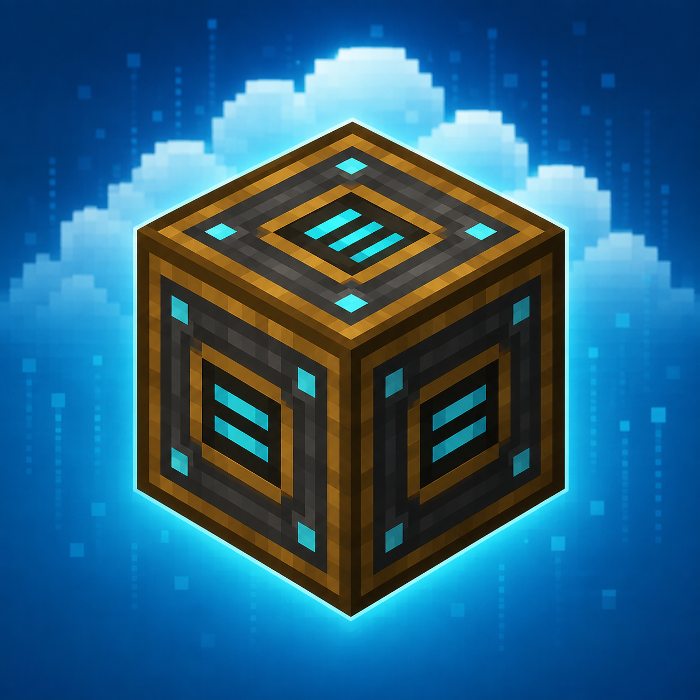

<p align="center">
  
</p>

<h1 align="center">Digital Storage Cloud</h1>

<p align="center">
  Player-owned cloud storage for large stackable-item collections, integrated
  directly with Tom's Simple Storage.
</p>

<p align="center">
  <strong>Minecraft 1.20.1 · Fabric · Tom's Simple Storage</strong>
</p>

<p align="center">
  <a href="#ai-assisted-development">
    
  </a>
</p>

## Features

- Player-owned storage volumes with data-driven capacity tiers.
- Lightweight accessors: bind any number of physical blocks to one Volume.
- An Advanced Inventory Hopper with larger atomic transfer batches.
- Tom network deduplication, connector scan staggering and migration tools.
- Sharded, asynchronous persistence with per-file quarantine and schema guards.

## Installation

Install the following on both the server and clients that open the management
screen:

- Fabric Loader 0.15.11 or newer for Minecraft 1.20.1.
- Fabric API for Minecraft 1.20.1.
- Tom's Simple Storage (1.7.1 is the compile and verification baseline; the
  metadata does not pin an exact Tom version).
- Digital Storage Cloud.

Place the downloaded Mod JARs in the instance or server `mods/` directory. Do
not install the `-sources.jar` file.

For commands, recipes, binding, upgrades and troubleshooting, see the
[中文玩家使用指南](PLAYER_GUIDE_zh_CN.md).

## Overview

Digital Storage Cloud is a high-performance Minecraft 1.20.1 Fabric storage
backend for Tom's Simple Storage, not a replacement for Tom's terminal, search,
crafting or network operations. Logical, player-owned volumes hold bulk
stackable items while ordinary chests remain the intended home for tools,
equipment and other special items. Physical blocks are lightweight accessors:
any number of accessors can link to one volume while Tom and Fabric Transfer API
consumers see the same canonical `Storage<ItemVariant>` instance.

## Player commands

```text
/digitalstorage volume create <name>
/digitalstorage volume list
/digitalstorage volume rename <volume UUID> <name>
/digitalstorage volume delete <volume UUID>

/digitalstorage accessor bind <x> <y> <z> <volume UUID>
/digitalstorage accessor clear <x> <y> <z>
/digitalstorage accessor inspect <x> <y> <z>
```

`/dsc` is the short alias. A Volume can be deleted only when it is empty and no
loaded accessor remains bound to it. Operator-only diagnostics remain available:

```text
/digitalstorage stats
/digitalstorage stats deep
/digitalstorage diagnostics
/digitalstorage probe <x> <y> <z>
/digitalstorage selftest
/digitalstorage benchmark
/digitalstorage reloadconfig
/digitalstorage flush
```

## Storage behavior

- Data-driven tiers provide 64, 128, 256, 512 and 1024 variant capacities by
  default.
- Each default upgrade consumes one resource type and follows the capacity
  curve: 16, 32, 64 and 128 diamonds. Datapacks can tune these values for a
  modpack, but upgrade tiers must still use exactly one resource and no XP.
- Each exact item variant intentionally accepts up to `2,147,483,647` items as
  a safety ceiling. Existing stored data above that ceiling remains extractable.
- Insert and extract are transaction-safe, including nested atomic Tom hopper
  transfers.
- `allowUnstackableItems` defaults to `true` and lets each Volume owner explicitly
  opt in to max-stack-size-one items; new Volumes still default to Reject. Legacy
  `rejectUnstackableItems` values are migrated inversely to preserve existing
  server behavior. Extraction is always allowed, including after opting out.
- Item/tag filters and per-variant NBT limits apply when creating a new variant.
- Malformed volumes are quarantined individually and their raw NBT is retained.
- A newer cloud schema is rejected instead of being rewritten by an older Mod.

## Code overview

Short module introductions are next to the relevant code:

- [Storage and persistence](src/main/java/dev/kehai/digitalstorage/storage/README.md)
- [Tom integration and migration](src/main/java/dev/kehai/digitalstorage/optimization/README.md)
- [Local dependency](libs/README.md) and [texture tool](tools/README.md)

## Build

Clone this repository and use a Java 17 JDK. Set `JAVA_HOME` to that JDK and
ensure its `bin` directory is on `PATH`. The checked-in wrapper selects Gradle
8.6; no separate Gradle installation is required.

Development sources use official Mojang mappings for Minecraft 1.20.1. Loom
remaps the Fabric release JAR to intermediary; keep platform inventory and Tom
integration inside `platform/fabric` when changing shared code.

From the repository root on Windows PowerShell:

```powershell
.\gradlew.bat build
```

On Linux or macOS:

```sh
sh ./gradlew build
```

The first build needs internet access for the Gradle distribution and Maven
dependencies. Tom's Storage 1.7.1 is already included in `libs/`; development
runtime libraries are prepared automatically. Building does not require local
worlds, manually generated textures or files outside this checkout.

The distributable is `build/libs/digital-storage-cloud-<version>.jar`, where
`<version>` is `mod_version` in `gradle.properties`. The matching `-sources.jar`
is source code, not a playable mod. Development/shadow JARs are not the release
artifact. To run a development instance, use `runClient` or `runServer` instead
of `build`; server EULA acceptance is required before a server can run.

## AI-assisted development

This project is developed with assistance from AI tools, including OpenAI Codex.
AI assistance is used for implementation, code review, documentation and test
planning. All AI-assisted changes are reviewed and tested by the maintainer
before release, and the maintainer remains responsible for the resulting code,
documentation and published artifacts.
